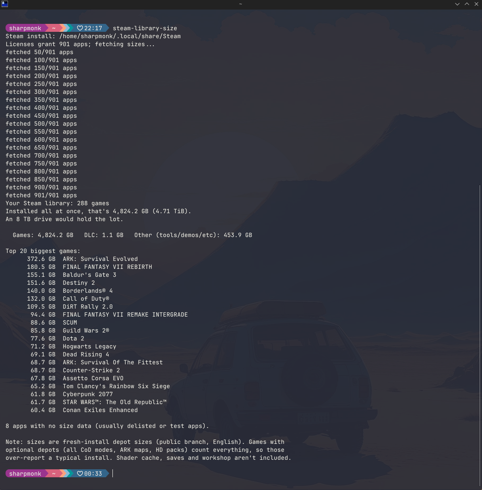

# steam-library-size

**How big would your Steam library be if you installed *every* game you own?**



Steam only knows the size of games you've already installed. SteamDB's calculator
doesn't do install sizes, and the old web calculators are dead — and they needed a
public profile anyway. This tool answers the question locally: it reads the license
cache your own Steam client already has on disk, then asks Steam **anonymously** for
each game's depot sizes. **No API key. No public profile. Works with fully private
accounts.**

## Install

**You need:** Python 3.10 or newer, and Steam installed on the same machine (logged
in at least once — that's what writes the license cache this tool reads). Your games
do **not** need to be installed.

The recommended installer is **pipx** — it's like pip, but it puts command-line tools
in their own isolated environment so they can't break (or be broken by) anything else
on your system.

### Windows

1. Install Python from [python.org/downloads](https://www.python.org/downloads/) —
   on the first installer screen, **tick "Add python.exe to PATH"**.
2. Open a new Command Prompt (or PowerShell) and run:
   ```
   py -m pip install --user pipx
   py -m pipx ensurepath
   ```
3. **Close and reopen** the terminal (that's what makes the new PATH take effect), then:
   ```
   pipx install steam-library-size
   ```

### Linux

Install pipx from your package manager, then install the tool:

```
# Debian/Ubuntu:  sudo apt install pipx
# Fedora:         sudo dnf install pipx
# Arch:           sudo pacman -S python-pipx
pipx ensurepath
```

Close and reopen the terminal, then:

```
pipx install steam-library-size
```

### macOS

```
brew install pipx
pipx ensurepath
```

Close and reopen the terminal, then:

```
pipx install steam-library-size
```

### Just want a single script to read and run?

The whole tool also exists as one plain Python file:
[`standalone/steam_library_size.py`](standalone/steam_library_size.py). Download it,
install its two dependencies, and run it:

```
python3 -m pip install vdf "steam[client]"
python3 steam_library_size.py
```

Same behavior, same flags. A test in CI keeps it byte-for-byte in sync with the
packaged version.

### No pipx? Plain pip works too

```
python3 -m pip install --user steam-library-size    # Windows: py -m pip install --user steam-library-size
```

### Troubleshooting

- **`steam-library-size: command not found`** — you didn't reopen the terminal after
  `pipx ensurepath` (or skipped it). Reopen and try again.
- **`pipx: command not found` right after installing it** — same fix: new terminal.
- **`error: Could not find a Steam install`** — start Steam once and log in, or pass
  the location yourself: `steam-library-size --steam-dir "D:\Steam"`.

## Windows app (no Python needed)

Prefer a windowed app? Grab `SteamLibrarySize.exe` from the
[latest release](https://github.com/sharpmonk/steam-library-size/releases),
double-click it, and hit **Scan**. It reads the same local Steam data as the
command-line tool — nothing is uploaded anywhere.

> Windows SmartScreen will warn about an unrecognised app the first time
> (the exe isn't code-signed). Click **More info → Run anyway**.

## Usage

Just run it:

```
steam-library-size
```

Real output from a real library:

```
Your Steam library: 288 games
Installed all at once, that's 6,401.0 GB (6.25 TiB).
An 8 TB drive would hold the lot.

  Games: 6,401.0 GB   DLC: 8.7 GB   Other (tools/demos/etc): 545.2 GB

Top 5 biggest games:
      572.6 GB  Call of Duty®
      496.6 GB  ARK: Survival Evolved
      208.2 GB  iRacing
      182.1 GB  Arma 3
      180.5 GB  FINAL FANTASY VII REBIRTH

8 apps with no size data (usually delisted or test apps).
```

### Options

| Flag | What it does |
|---|---|
| `--top N` | How many of the biggest games to list (default: 20) |
| `--json` | Machine-readable JSON (totals + every app) to stdout |
| `--csv` | One CSV row per app: `appid,name,type,size_bytes` |
| `--include-dlc` | Add owned DLC sizes to the headline total |
| `--include-all` | Add everything owned (DLC, tools, demos, soundtracks, servers) |
| `--os {windows,linux,macos,all}` | Which platform's depots to size. Default: your platform — except Linux uses Windows sizes, matching what Proton installs. `all` sums every platform (upper bound). |
| `--steam-dir PATH` | Point at your Steam install if auto-detection fails |

Progress goes to stderr, so `--json`/`--csv` pipe cleanly.

## How it works

Your Steam client keeps a cache of every license on your account in
`appcache/packageinfo.vdf`. The tool parses that file to get the full list of app IDs
you own, then makes one anonymous connection to Steam's product-info service (the same
PICS system the Steam client uses) to fetch each app's depot manifest sizes, and sums
the public-branch, English, your-platform depots per app.

## Accuracy caveats

- Sizes are **fresh-install sizes today** (uncompressed public-branch depots). Games
  with optional depots — every Call of Duty mode, all ARK maps, HD texture packs —
  count all of them, so those over-report a typical install.
- Shader cache, save games, and workshop content are not included.
- Owned-but-delisted apps may have no size data; they're counted and reported as such,
  never silently dropped. Same for apps that fail to fetch.

## Privacy

Nothing about your account leaves your machine. The only network traffic is an
anonymous (not-logged-in) Steam connection querying public app metadata by app ID —
the same data any Steam client can see.

## Platform support

- **Linux**: verified, including Flatpak and Snap Steam installs.
- **Windows / macOS**: path detection implemented and unit-tested, but not yet
  verified on real machines — [issues](https://github.com/sharpmonk/steam-library-size/issues)
  and reports welcome.

## License

MIT — see [LICENSE](LICENSE).
